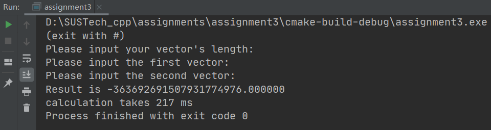

# Vector_DotProduct

***Aimed to optimize the process of vector dot product calculation***
<font color=red size=3><b>Each test of time cost is under the same pair of vetors with length 200 million</b></font>

## Some Basic features

### One execution Multiple calculation!

In this program, you can try multiple dot product of different vectors just in one execution. If you want to exit, just type #.


### Won't crash down when you input something wrong!

This program will detect whether your input is valid, if not, you are asked to input again.


## Version_1.0

### Brutal Force

Simply use the definition of dot product. It's very easy to implement but definitely has low efficiency in time.

```c++
    // begin time
    auto start1 = std::chrono::steady_clock::now();
    for (int i = 0; i < n; ++i) {
        result += f1[i] * f2[i];
    }
    // end time
    auto end1 = std::chrono::steady_clock::now();
```

Here we use float as the data type since float has a better behavior in efficiency. Also we use dynamic array to store what we input for its high efficiency when doing indexing, invoking and calculating.

==However, to make things more clear and convincing, we will also see what will happen if we use double and vector separately, compare their time cost and give a reasonable explanation.==

### Time Cost
test this brutal force algorithm with two vectors each has 200 million elements and output its' calculation time.


We can see that the calculation of dot product takes 1165ms, which has a lot of space to do our optimization.

Also, let us see how do double and vector behave!

<center><font color=red size=4><b>double</b></font></center>


As expected, double is lower in efficiency than float since double occupies 8 bytes while float just 4 bytes. This will bring about more waste on time when doing calculation for operating 64 bits other than 32 bits one time.

<center><font color=red size=4><b>vector</b></font></center>


Additionally, the time cost of vector is also within our expectation. It's even lower than double. 

Here we need to clarify the principle when allocating memory to vector: 

>when initiating a vector, its default size = capacity = 0. That's to say, CPU will not initiatively allocate memory for a vector, thus when using ```vector.pushback``` but there is not enough space for vector to store a new 4-byte float(capacity = size), this time vector will reapply a new memory space which is twice as before. Then it will copy the elements in the original space to the newly-applied memory, put the element you pushback in the tail of the new vector and then set the original memory space free. The whole process is very low in efficiency.

## Version_2.0

### Block Vector Calculation

Use divide and conquer, partition the vector with many small block vectors with length 6, and calculate the result of dot product of the two corresponding block vectors. And then we combine each of the dot product. This way we can decrease the loop counts and arithmetic times.

==Here we can divide it into small unit vectors with length 2, 4, 6 and 8, depending on the data size.==

```c++
float block(const float *f1, const float *f2, int i) {
    return f1[i] * f2[i] + f1[i + 1] * f2[i + 1] + f1[i + 2] * f2[i + 2] + f1[i + 3] * f2[i + 3] +
           f1[i + 4] * f2[i + 4] + f1[i + 5] * f2[i + 5];
}
```

```c++
// begin time
auto start1 = std::chrono::steady_clock::now();
int m = n % 6;
for (int i = 0; i < m; ++i) {
    result += f1[i] * f2[i];
}
for (int i = m; i < n; i += 6) {
    result += block(f1, f2, i);
}
// end time
auto end1 = std::chrono::steady_clock::now();
```

### Time Cost
test this block vector algorithm with two vectors each has 200 million elements and output its' calculation time.


We can see from the screenshot that after this divide step, the time cost is reduced by half.

## Version_3.0

### Parallel Computing

We take notice of that in version_2.0 when we do add operation to add the block sum to result, we just simply let``` result += block(f1, f2, i) ```. But according to Eric said in "Optimizing Dot Product"(Dec 10, 2012), "the problem is, this code must still run basically sequentially because each statement depends on the previous statement." Therefore, generated by this idea. We can do the optimization as followed codes.

```c++
float dot1 = 0.0, dot2 = 0.0, dot3 = 0.0, dot4 = 0.0, dot5 = 0.0, dot6 = 0.0;

void block(const float *f1, const float *f2, int i) {
    dot1 += f1[i] * f2[i];
    dot2 += f1[i + 1] * f2[i + 1];
    dot3 += f1[i + 2] * f2[i + 2];
    dot4 += f1[i + 3] * f2[i + 3];
    dot5 += f1[i + 4] * f2[i + 4];
    dot6 += f1[i + 5] * f2[i + 5];
}
```

```c++
for (int i = m; i < n; i += 6) {
    block(f1, f2, i);
}
result += dot1 + dot2 + dot3 + dot4 + dot5 + dot6;
```
This meant there was no longer any dependency between statements, and the CPU’s out of order execution engine could run all four of these as soon as the data was available. In expectation, it will run faster than just the block calculation.

### Time Cost
Let's test this parallel computing algorithm with two vectors each has 200 million elements and output its' calculation time.


We can see from the pic that this parallel design based on block actually has some progress in time although this optimization is not so obvious.

## version_4.0

### Using SSE(Streaming SIMD Extensions) Optimized Dot Product

SSE is short for Internet Streaming SIMD Extensions. In addition to maintaining the original MMX instructions, SSE added 70 new instructions, which improved the efficiency of memory usage and made the memory operations faster while speeding up floating point operation. Here we use SSE to deal with the vector dot product and see how fast it works!

The codes below is partially learnt from what I searched in the Internet. And here showing these codes is just a summary a new optimization of dot product.

```c++
float sse_inner(const float *a, const float *b, unsigned int size) {
    float z = 0.0f, fres = 0.0f;
    float ftmp[4] = {0.0f, 0.0f, 0.0f, 0.0f};
    __m128 mres;
    if ((size / 4) != 0) {
        mres = _mm_load_ss(&z);
        for (unsigned int i = 0; i < size / 4; i++) {
            mres = _mm_add_ps(mres, _mm_mul_ps(_mm_loadu_ps(&a[4 * i]), _mm_loadu_ps(&b[4 * i])));
        }
        __m128 mv1 = _mm_movelh_ps(mres, mres);
        __m128 mv2 = _mm_movehl_ps(mres, mres);
        mres = _mm_add_ps(mv1, mv2);
        _mm_store_ps(ftmp, mres);
        fres = ftmp[0] + ftmp[1];
    }

    if ((size % 4) != 0) {
        for (unsigned int i = size - size % 4; i < size; i++) {
            fres += a[i] * b[i];
        }
    }

    return fres;
}
```

```c++
result += sse_inner(f1, f2, n);
```

### Time Cost

Let's test this parallel computing algorithm with two vectors each has 200 million elements and output its' calculation time.



We notice that the progress is obvious since we use SIMD floating point register here to do the task. The time reduces by 100ms or so.

## Test With OpenBLAS

### OpenBLAS

OpenBLAS is an optimized Basic Linear Algebra Subprograms (BLAS) library based on GotoBLAS2 1.13 BSD version. It's one of the fastest matrix operation library in the world. Let's see how it behaves under our 400 million vector elements!

```c++
result += cblas_sdot(n, f1, 1, f2, 1);
```

Before running the code, we have to compile the project cloned from github website, link it into the project cmakeFile and include the head file.

```c++
#include <cblas.h>
```

### Time Cost

Let's test this parallel computing algorithm with two vectors each has 200 million elements and output its' calculation time.


## Summary

In this assignment we are working on how to optimizing vector dot product and how different ideas works and why. Up to now, we have worked out 4 versions and seven ways to do the dot product, from brutal_double to OpenBLAS. And each of them differs in efficiency, let's summarize from the data below.

|  method   | result  | time cost |
|  :----:  | :----:  | :----: |
| brutal_vector  | -365884255676600942592.000000 | 2042 ms |
| brutal_double  | -364535047238995935232.000000 | 1206 ms |
| brutal_float  | -365884255676600942592.000000 | 1165 ms |
| block  | -364864823679699124224.000000 | 427 ms |
| parallel  | -364598196508009955328.000000 | 328 ms |
| SSE  | -363692691507931774976.000000 | 217 ms |
| OpenBLAS  | -364535040560110501888.000000 | 116 ms |

We note that the results are different in some method, that's because in different method, we deal with those data in different ways. For example, between block and brutal_float, in brutal_float we simply add each product together to the final result(==every element can cause a precision lost to the final result==), but in block we first let a unit block(length 6) multiple correspondingly and add them together, then add this block's result to the final result(==every six elements may cause a precision lost==). <font color = red>See from the chart, the result of block is -364864823679699124224.000000 which is loser to -364535040560110501888.000000(OpenBLAS) than -365884255676600942592.000000(brutal_float), This also verify our explanation!</font>

## Others

### About the test case

All the test cases used above to test each method's efficiency is from the same pair of vectors, they are stored in two separated binary file(200M float data occupies almost 800MB disk memory) and tested by the same computer(the same CPU). Therefore, using them to do the comparison is convincing. Which needs mentioning is that here we only record the calculation time cost but ignore the IO time cost.


Below shows how we utilize these 200M data:

```c++
int n = 200000000;
    ifstream file1(R"(D:\SUSTech_cpp\assignments\assignment3\random1.dat)", ios::binary);
    ifstream file2(R"(D:\SUSTech_cpp\assignments\assignment3\random2.dat)", ios::binary);
    auto* f1 = new float[n];
    auto* f2 = new float[n];
```

```c++
if (file1.is_open()) {
        for (int i = 0; i < n; ++i) {
            file1.read(reinterpret_cast<char*>(&f1[i]), sizeof(f1[i]));
        }
    }
```

```c++
if (file2.is_open()) {
        for (int i = 0; i < n; ++i) {
            file2.read(reinterpret_cast<char*>(&f2[i]), sizeof(f2[i]));
        }
    }
```

## Source Code

See and clone the whole project from this github repository!
